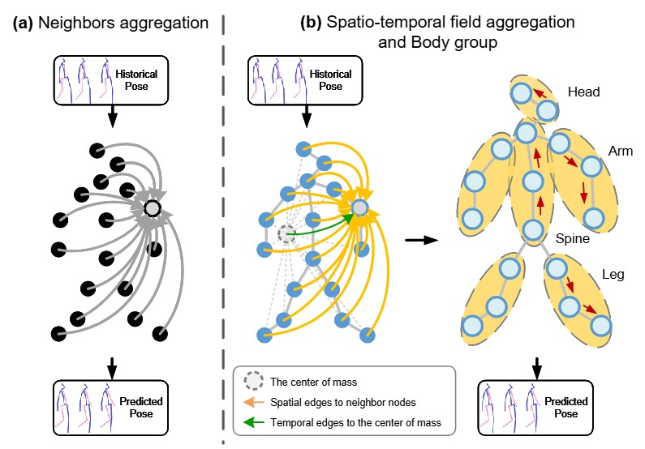
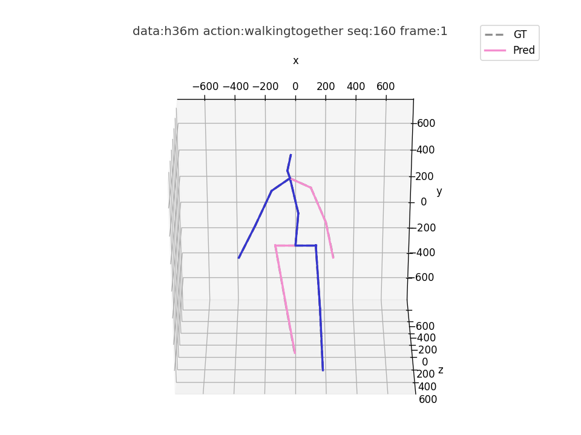
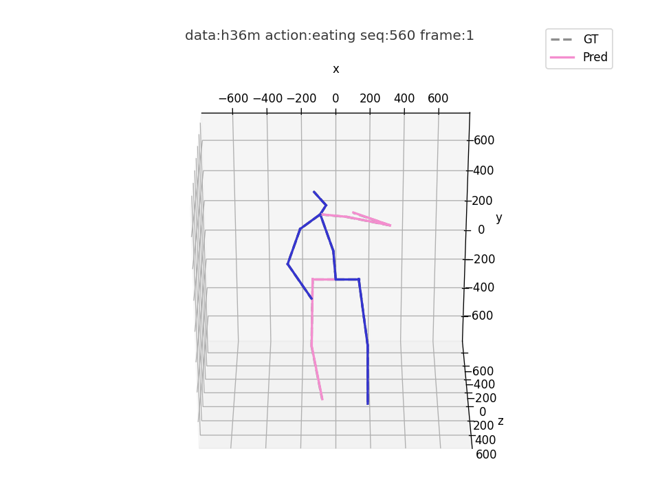
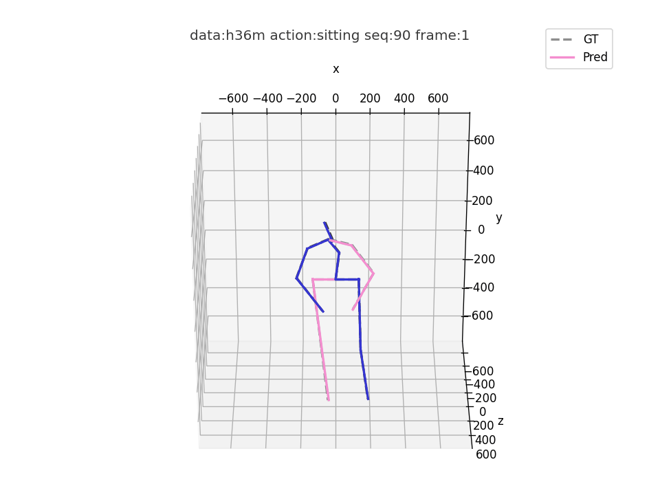

# GGMotion

Code for our paper:  
**GGMotion: Group Graph Dynamics-Kinematics Networks for Human Motion Prediction**  
Shuaijin Wan, Huaijiang Sun

<div align="center">
  
</div>

<div align="center">
  <table style="border-collapse: collapse;">
  <tr>
    <td align="center"><b>短期预测</b></td>
    <td></td>
    <td></td>
    <td></td>
  </tr>
  <tr>
    <td align="center"><b>长期预测</b></td>
    <td></td>
    <td></td>
    <td></td>
  </tr>
  </table>
</div>

## Recommand Dependencies
* Cuda 11.7
* Python 3.8
* Pytorch 1.13.1

## Data preparation
### Human3.6M
Download Human3.6M dataset from its [website](http://vision.imar.ro/human3.6m/description.php) and put the files into "data" with the dataset folder named "h3.6m".

### CMUMocap
Download CMUMocap dataset from its [website](http://mocap.cs.cmu.edu) and put the files into "data" with the dataset folder named "CMUMocap".

### 3DPW
Download 3DPW dataset from its [website](https://virtualhumans.mpi-inf.mpg.de/3DPW) and put the files into "data" with the dataset folder named "3DPW".

After the prepartion work, the data folder should have the following structure:
```
/data
├── h36m
    ├── dataset
        ├── S1
        ├── S5
        ├── ...
├── CMU
    ├── test
    ├── train
├── 3DPW
    ├── test
    ├── train 
    ├── validation          
```

## Train
### Human3.6M
To train a short-term motion prediction model, run
```
python main_h36m.py --manner all --cfg cfg/h36m_short.yml
```

To train a long-term motion prediction model, run
```
python main_h36m.py --manner all --cfg cfg/h36m_long.yml
```

The experimental results will be saved in exp/ .

### CMUMocap
To train a short-term motion prediction model, run
```
python main_cmu.py --manner all --cfg cfg/cmu_short.yml
```

To train a long-term motion prediction model, run
```
python main_cmu.py --manner all --cfg cfg/cmu_long.yml
```

The experimental results will be saved in exp/ .

### 3DPW
To train a short-term motion prediction model, run
```
python main_3dpw.py --manner all --cfg cfg/3dpw_short.yml
```

To train a long-term motion prediction model, run
```
python main_3dpw.py --manner all --cfg cfg/3dpw_long.yml
```

The experimental results will be saved in exp/ .

### Evaluate
### Human3.6M
Take our trained model as an example, to evaluate a short-term motion prediction model, run
```
python main_h36m.py --manner all --cfg cfg/h36m_short.yml --mode eval --ckpt "your model path"
```

To evaluate a long-term motion prediction model, run
```
python main_h36m.py --manner all --cfg cfg/h36m_long.yml --mode eval --ckpt "your model path"
```

### Visualization
### Human3.6M
Visualize the results of pretrained mode as an example, to visualize a short-term motion prediction model, run
```
python main_h36m.py --manner all --cfg cfg/h36m_short.yml --mode viz --seq 90 --act smoking
```

To visualize a long-term motion prediction model, run
```
python main_h36m.py --manner all --cfg cfg/h36m_long.yml --mode viz --seq 90 --act smoking
```


